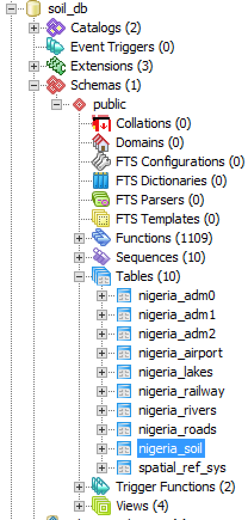
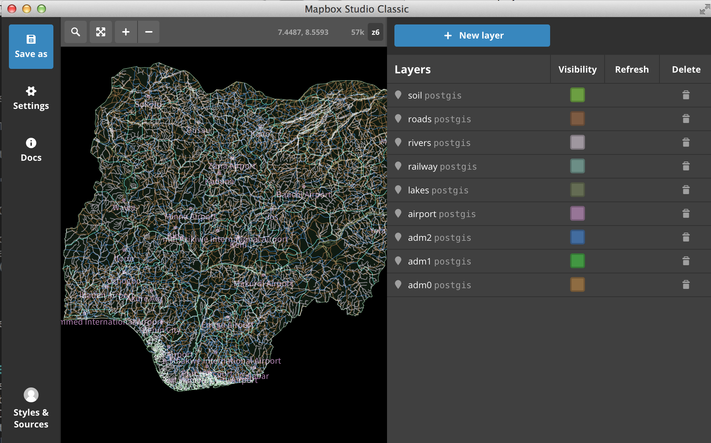

#Vector Tile Configuration
Resources: `https://github.com/mapbox/awesome-vector-tiles`
## Method I: Geoserver
### Installation
- Install JRE 1.8 x86
- Install GeoServer 2.9.1
- Get vector tile extension files from `http://ares.boundlessgeo.com/geoserver/2.9.x/community-2016-08-03/`
- Install the extension files: copy the 4 jar files to `C:\Program Files (x86)\GeoServer 2.9-RC1\webapps\geoserver\WEB-INF\lib`
- Start GeoServer: `bin\startup.bat`

### Create pbf vector tiles
- download my python script from GitHub: `https://github.com/gismatthew/VectorTiles.git`
	- eg. `C:\Users\mel044\Documents\GitHub\VectorTiles`
- configuration: change the URL setting in the script as desired (line 155 for `pbf` format)
- Launch cmd.exe, `cd C:\Users\mel044\Documents\GitHub\VectorTiles\back-end`
- Run the script: `C:\Python27\ArcGISx6410.3\python.exe createTilesGeojson.py`

### Visualize pbf vector tiles
- copy the generated tiles to a folder
- set appropriate permissions

	```bash
	sudo find builds -type d -exec chmod 777 {} \;
	sudo find builds -type f -exec chmod 666 {} \;
	```

- use Leaflet.MapboxVectorTile for visualization

##Method II: PGRestAPI
**Note** This method is not working due to

- hard to install & trouble-shooting
- this package has been discontintued and its installation requires really old dependencies

[Installation](https://github.com/spatialdev/PGRestAPI/blob/master/docs/Windows_Install.md) is painful.

### Install Mapnik
Also: [tiled vectors in mapnik](http://mike.teczno.com/notes/postgreslessness-mapnik-vectiles.html)

Instruction: `https://github.com/spatialdev/PGRestAPI/blob/master/docs/OSX_Install.md`

* install Node.js
* Install GDAL (for .shp outputs from queries)
* Install Mapnik


	``` bash
	# https://github.com/mapnik/mapnik/wiki/MacInstallation_Homebrew
	brew install cairo --without-x --without-glib
	brew install icu4c
	brew link icu4c
	brew install boost
	brew install boost-python
	brew install proj
	brew install jpeg
	brew link jpeg
	brew install libtiff
	brew install gdal --with-libtiff=/usr/local/lib
	brew install ossp-uuid
	brew install postgis
	brew install harfbuzz
	git clone https://github.com/mapnik/mapnik.git
	cd mapnik
	./configure
	make # in case of error, run the following line
	# git submodule update --init deps/mapbox/variant
	make install
	```
## Method III: Mapbox GL

### Backend
- TileMill is able to
	- publish GIS layers, including PostGIS layers
	- organize multiple layers
	- stylize layers
	- export into mbtiles format
	- can be invoked from the command-line: [Here](https://www.mapbox.com/tilemill/docs/manual/exporting/)
	- **but** the mbtiles are PNGs.
- Mapnik
	- working on it
	- bin: /usr/local/Cellar/mapnik
- Mapbox Studio (Deadend)
	- Online version. Not able to export my files.
- **Mapbox Studio Classic**
	- Backend
		- Add a new layer
		- Rename it to a better name (default is 'data'), which will be used as its `id` at the front-end to reference it
		- Save the project (otherwise you cannot download mbtiles)
		- Go to "Settings".
			- Set up Minzoon/Maxzoom
			- "Export to MBTiles"
		- Copy the generated `mbtiles` file to the server
		- host it on the server, refer to project `ssrl-mbtiles`
			- `node server.js`
			- inside `server.js`, use `res.status(204)` to supress stream of 404 errors at the front-end.
	- Frontend: see the following section
- Basemap (backend):
	- Download OSM's mbtiles package for the entire planet from zoom level 0 to 8 (261MB)
	- Optional: Create a new Style with new Mapbox Studio
	- Publish the base layer:

	```
	sudo npm install -g tileserver-gl-light
	tileserver-gl-light *.mbtiles
	```
- **Using `tilelive-bridge`**
    - `Mapbox Studio Classic` uses mapnik's `xml` to generate `pbf` tiles.
    - `tilelive-bridge` is able to read mapnik's `xml` and generate `pbf` tiles.
    - mapnik's `xml` natively supports commonly used GIS formats. By setting the type as `OGR` allows as many formats as `ogr` is able to handle. Furthermore, it supports [OGR Virtual Format](http://www.gdal.org/drv_vrt.html) to provide an anchor file for access to non-file oriented datasources.
    - **Implementation**
        - **Benchmark**: 4 methods are implemented, 3 methods are used to test their performance
            - for simplicity, only the filesize of tile `4/8/7` is compared:
            
                | Format | File Size | Increase |
                | --- | --- | --- |
                |File GDB | 309KB | - |
                | SQLite | 362KB | 17% |
                | PostGIS | 414KB | 34% |
            - Summary: It's obvious that PostGIS produces the largest file size and also the slowest solution. In application, `File GDB` should be used not only for performance reason, but also is convenient for projects which uses `File GDB` for managing data.
        - `File GDB` --> `Postgres` --> `mbtiles` --> `tilelive-bridge`
            - Step 1: From `File GDB` to `Postgres`
                - **Description**: `Mapbox Studio Classic` supports several GIS formats (`shp`, `KML`, `GeoJSON`, `GPX`, `CSV`, `TIF`, `VRT`, `PostGIS` and `SQLite`) but only `shp` and `PostGIS` are relevant to our project. `PostGIS` format is used here because 1) all our GIS layers are stored in the file GDB, which can be easily transferred into `Postgres` database server, which gives us the best way of organizing our GIS layers for desktop (Client-Server, eg. ArcGIS, QGIS etc.) as well as online web mapping (Browser-Server, eg. our current website) scenarios; 2) GDB itself is much superior than shapefile's out-dated DBF engine: no limitation on the length of `TEXT` field and multilingual support, to name just a few.
                - **Steps:**
                    * On the server, launch `cmd.exe`
                    * Run the following command to import a layer (You can make a batch to import multiple layers):

                    	``` bash
                    	################################################
                    	# NOTE: Run this command as a single line!     #
                    	#       Remove all comments before excute it!  #
                    	#       Comments start with '#' sign.          #
                    	################################################
                    	ogr2ogr -f "PostgreSQL" # our output format is PostSQL
                    
                    	  ##### Start: connection string #####
                    	  # server's name, user's login name / password
                    	  PG:"host=localhost user=gisuser1 password=webgis1"
                    	  # target database name
                    	  dbname=soil_db
                    	  ##### End: connection string #####
                    
                    	  ##### Start: input setting #####
                    	  # path to the target File GDB
                    	  "C:\WestAfricaFoodSecurity\BaseMaps.gdb"
                    	  # name of the feature class to be imported
                    	  Nigeria_adm1
                    		  ##### End: input setting #####
                    
                    		  ##### Start: import configuration #####
                    		  # rename the output, follow this scheme:
                    		  # countryname_layername
                    	  -nln nigeria_adm1
                    	  # rename the geometry's field as 'geom'
                    	  -lco GEOMETRY_NAME=geom
                    	  # define the output's coordinate system as WGS84
                    	  -t_srs EPSG:4326
                    		  ##### End: import configuration #####
    	                 ```
    	                   
                        * **Optional** On the server, launch `pgAdmin III` to confirm the previous step (layer import) are successful (see the screenshot below). <br>
            * Step 2: Download / Install `Mapbox Studio Classic`  (outdated, skip this step)
                * **Description**: As a matter of fact, `Mapbox Studio Classic` is deprecated by MapBox, and replaced by the online platform `Mapbox Studio`. They essentially do the same job -- managing your spatial data, designing custom map styles, and authoring them as consumable online mapping resources. In our project we use `Mapbox Studio Classic` to prepare vector tiles because 1) it is much faster to do this work in the native software than using the browser, 2) we want our data confidential and bypass any possible access by MapBox's online server.
                * **Steps:**
                    * [Go to here](https://www.mapbox.com/mapbox-studio-classic/). A popup says
                    	> 'Mapbox Studio Classic has been replaced by the new Mapbox Studio.'

                    	> Try Mapbox Studio
                    
                    	> I really want Mapbox Studio Classic
                    * Click the link "I really want [Mapbox Studio Classic](https://www.mapbox.com/mapbox-studio-classic/#)" to dismiss the popup.
                    * Find the download link. Download and install `Mapbox Studio Classic`.
            * Step 3: Making `mbtiles`
                * **Description:** Use `Mapbox Studio Classic` to prepare the vector tiles from the tables we populated in the PostGreSQL DB Server. Basically we need to tell `Mapbox Studio Classic` 1) where our vector layers are located (in the PostGreSQL DB Server), 2) add all layers we need as 'sources', 3) package all those 'sources' into `mbtiles` format which is a container (technically sqlite database) packed with vector tiles (`pbf` files).
                * **Resources:**
                    * https://www.mapbox.com/help/source-quickstart/
                    * https://www.mapbox.com/help/source-manual/#optimizing-uploads
                * **Steps:**
                    1. On your computer, launch `Mapbox Studio Classic`
                    2. At bottom-left corner, click 'Styles & Sources'
                    3. A new panel pops up, click '+ New style or source'
                    4. A new dialog box pops up. At the right-side, click the big black '+' button (labeled as 'Blank Source')
                    5. The software updates its window and is ready to add a source. In this source, you are going to import all vector layers from the PostGreSQL DB Server.
                    6. At the top-right corner, click the big blue '+ New layer' button to add a layer
                    7. A new dialog box pops up. We are going to import layers from 'PostGIS' database, so click 'PostGIS' at the bottom of this dialog.
                    8. The dialog box is dismissed. The software's right panel is ready for your configuration. At the top there are 3 tabs: 'Configure', 'Fields', 'SQL'
                        * Configure page:
                            * PostGIS group:
                              * database_name: `soil_db`
                              * pg_hostname: `gis1test.usask.ca`
                              * port: `5432`
                              * pg_username: `gisuser1`
                              * pw: `webgis1`
                            * Projection group:
                              * `WGS84`
                        * SQL page:
                            * You can see number '1' and next to it at the right side is where you write the table's name: eg. `nigeria_adm0`
                    9. There is a white 'data' label next to the 3 tabs at the left side. This is the default name for the imported layer. We want to rename it to a better name instead of 'data': eg. `adm0`. So click the little 'rename' button beneath the white 'data' label.
                    10. A new dialog box pops up. Type in a new name (eg. `adm0`) and click 'Update'.
                    11. There is a 'Done' button next to the 3 tabs at the right side. Click it to accept the configuration.
                    12. Wait for the softwware to load your data. Once it's fully loaded, you should visually see the rendered result in the black canvas (central panel). Also you should see the layer listed in the right panel (eg. `adm0 postgis`).
                    13. Repeat step 6, 7, 8, 9, 10, 11 (f, g, h, i, j, k) to import other layers. You are supposed to import all layers for a country or a group. (see the image below) <br> 
                    14. At the top-left corner there is a 'Save As' button. Click it to save it to disk before continue.
                    15. Now 'Save As' button becomes 'Saved' button. Below it is the 'Settings' button. Click it.
                    16. A new panel pops up. Click 'Export to MBTiles'.
                    17. A progress bar shows up. Wait till it is finished.
                    18. Click 'Download' button. 'Save Tiles' dialog  box pops up. Do rename the downloaded file: eg. 'nigeria.mbtiles' and point it to a safe place where you can find.
                    19. You can locate it on your hard drive. You may be startled at the dramatic small filesize. In my case, all the nigeria's layers are 25.2MB in the `shapefile` format. Yet the produced `mbtiles` filesize is merely 3MB.
            * Step 4: Hosting vector tiles
                * **Description:** We need to publish our vector tiles as a service so that our front-end web mapping application can consume it.
                * **Steps (if Step 3 is followed):**
                    * This method will publish `mbtiles` file into a service using `express`, `tilelive` and `mbtiles`:
                    
                    ``` js
                    var express = require('express');
                    var http = require('http');
                    var app = express();
                    var tilelive = require('tilelive');
                    require('mbtiles').registerProtocols(tilelive);
                    
                    tilelive.load('mbtiles:///Program Files (x86)/PostgreSQL/EnterpriseDB-ApachePHP/apache/www/soil-db/data/nigeria.mbtiles', function(err, source) {
                    
                     if (err) {
                      throw err;
                     }
                    
                     app.set('port', 8081);
                    
                     app.use(function(req, res, next) {
                      res.header("Access-Control-Allow-Origin", "*");
                      res.header("Access-Control-Allow-Headers", "Origin, X-Requested-With, Content-Type, Accept");
                      next();
                     });
                    
                     app.get(/^\/nigeria\/tiles\/(\d+)\/(\d+)\/(\d+).pbf$/, function(req, res) {
                    
                      var z = req.params[0];
                      var x = req.params[1];
                      var y = req.params[2];
                    
                      console.log('---------------------------------------');
                      console.log('get tile %d, %d, %d', z, x, y);
                    
                      source.getTile(z, x, y, function(err, tile, headers) {
                    
                       if (err) {
                        res.status(204);
                        console.log('err:' + err.message);
                       } else {
                        res.set(headers);
                        res.send(tile);
                       }
                      });
                     });
                    
                     http.createServer(app).listen(app.get('port'), function() {
                      console.log('Express server listening on port ' + app.get('port'));
				     });
				    });
				    ```
		    
                * **Steps (if Step 3 is not followed):**
                    * This method will publish a `xml` configuration file into a service using `express`, `tilelive` and `tilelive-bridge`:
                    * Part I: prepare the mapnik `xml` config file which an be used directly with `tilelive-bridge` to render the project into vector tiles (Part II).
                    * Part II: publish as a service
				* This method will publish `xml` config file into a service using `express`, `tilelive` and `tilelive-bridge`.
                    * See below for implementation

				    * `File GDB` --> `SQLite` --> `tilelive-bridge` (See below for implementation)
				    * `File GDB` --> `tilelive-bridge`
				        * the procedure of publishing vectore tile (by default) requires the following file structure in the project directory:

			            ``` bash
			            data/ # by default, its absolute path: %appache_root%/www/soil-db/data/
			            │───gdb.bat # the executable to start the service
			            └───server/
			                ├───index.js # tilelive-bridge's entry
			                ├───config/ # hosts project related configuration
			                │   ├───cache/ # hosts cached tiles from previous requests
			                │   ├───gdb.js # the actual script for publishing vector tiles
			                │   └───gdb.xml # the actual project related configuration
			                └───node_modules # tilelive-bridge's dependencies
			            
			            ```
	            
    		 			* `gdb.xml`: You may want to put more layers in the `xml`.

			            ``` xml
			            <?xml version="1.0" encoding="utf-8"?>
			            <!DOCTYPE Map[]>
			            <Map srs="+proj=merc +a=6378137 +b=6378137 +lat_ts=0.0 +lon_0=0.0 +x_0=0.0 +y_0=0.0 +k=1.0 +units=m +nadgrids=@null +wktext +no_defs +over">
			            <Layer name="adm0"
			              buffer-size="32"
			              srs="+proj=longlat +ellps=WGS84 +datum=WGS84 +no_defs">
			            	<StyleName>gdb_style</StyleName>
			            	<Datasource>
			            		<Parameter name="file">C:/WestAfricaFoodSecurity/BaseMaps.gdb</Parameter> <!-- path to the gdb -->
			            		<Parameter name="layer">Nigeria_adm0</Parameter> <!-- layer's id -->
			            		<Parameter name="type">ogr</Parameter>
			            	</Datasource>
			            </Layer>
			            <Layer> ... </Layer> <!-- another layer -->
			            </Map>
			            ```

	            		* `gdb.js`: You may want to configure
				            * `xml`'s path
				            * port
				            * requested url pattern

			            ``` js
			            var express = require('express');
			            var http = require('http');
			            var fs = require('fs');
			            var path = require('path');
			            var app = express();
			            var tilelive = require('tilelive');
			            var Bridge = require('..');
			            Bridge.registerProtocols(tilelive);
			            
			            //========================================
			            // place gdb.xml in the same directory
			            // or define its path if otherwise
			            //========================================
			            tilelive.load('bridge://' + __dirname + '/gdb.xml', function(err, source) {
			              if (err) {
			                throw err;
			              }
			              
			              //========================================
			              // port defaults to 8082
			              // change it if necessary
			              //========================================
			              app.set('port', 8082);
			                
			              app.use(function(req, res, next) {
			                res.header("Access-Control-Allow-Origin", "*");
			                res.header("Access-Control-Allow-Headers", "Origin, X-Requested-With, Content-Type, Accept");
			                next();
			              });
			            
			              //========================================
			              // default url pattern: /nigeria/z/x/y
			              // change it if necessary
			              //========================================
			              app.get(/^\/nigeria\/(\d+)\/(\d+)\/(\d+)$/, function(req, res) {
			                var z = req.params[0];
			                var x = req.params[1];
			                var y = req.params[2];
			                var cache_path = path.join(__dirname, 'cache00/' + z + '/' + x + '/' + y + '.pbf');
			                console.log('---------------------------');
			                // cache mechanism:
			                // if the tile's cache exists we serve it directly without publishing it from PostGIS
			                if (fileExists(cache_path)) {
			                  console.log('\x1b[32m', ' serve cached tile: ', z, x, y, '\x1b[0m');
			                  var stat = fs.statSync(cache_path);
			                  // the empty tile will have filesize = 0
			                  // otherwise, we have a valid tile, go ahead serve it
			                  if (stat.size > 0) {
			                    res.header("Content-Type", "application/x-protobuf");
			                    res.header("x-tilelive-contains-data", true);
			                    res.header("Content-Encoding", "gzip");
			                    res.header("Content-Length", stat.size);
			                    res.sendFile(cache_path);
			                  } else {
			                    res.status(204);
			                    res.send();
			                  }
			                } else {
			                  source.getTile(z, x, y, function(err, tile, headers) {
			                    console.log('\x1b[31m', ' get fresh tile: ', z, x, y, '\x1b[0m');
			                    if (err) {
			                      res.status(204); // if we have an empty tile, we throw 204 status to pacify the front-end library
			                      res.send();
			                      console.log(' err:' + err.message);
			                      // cache this tile (status)
			                      // the empty tile will have filesize = 0
			                      ensureDirectoryExistence(cache_path);
			                      fs.writeFile(cache_path, '', function(err) {
			                        if (err) throw err;
			                        console.log(' Tile cached: ' + cache_path);
			                      });
			                    } else {
			                      res.set(headers);
			                      res.send(tile);
			                      // cache this tile
			                      ensureDirectoryExistence(cache_path);
			                      fs.writeFile(cache_path, tile, function(err) {
			                        if (err) throw err;
			                        console.log(' Tile cached: ' + cache_path);
			                      });
			                    }
			                  });
			                }
			              });
			              http.createServer(app).listen(app.get('port'), function() {
			                console.log('Express server listening on port ' + app.get('port'));
			              });
			            });
			            
			            function ensureDirectoryExistence(filePath) {
			              var dirname = path.dirname(filePath);
			              if (directoryExists(dirname)) {
			                return true;
			              }
			              ensureDirectoryExistence(dirname);
			              fs.mkdirSync(dirname);
			            }
			            function directoryExists(path) {
			              try {
			                return fs.statSync(path).isDirectory();
			              } catch (err) {
			                return false;
			              }
			            }
			            function fileExists(path) {
			              try {
			                fs.accessSync(path, fs.F_OK);
			                return true;
			              } catch (err) {
			                return false;
			              }
			            }
			    	    ```

        
### Frontend
- Use  `Leaflet.MapboxVectorTile`
	- `http://localhost/~matthew/git/Leaflet.MapboxVectorTile/examples/matt.html`

- Use `mapbox-gl-ok.js` and `mapbox-gl-ok.css` for stunning frontend visualization [offline example](http://klokantech.github.io/mapbox-gl-js-offline-example/)
	- [API / examples](https://www.mapbox.com/mapbox-gl-js/example/polygon-popup-on-click/)
	- How to style your layer? [link](https://www.mapbox.com/mapbox-gl-style-spec/)
	- example

	``` js
	/* A working example
		http://localhost/~matthew/git/ssrl-mbtiles/builds/dev/
	*/
	      {
	        "id": "matt-prev-adm1", /* arbituary identifier */
	        "type": "fill",
	        "source": "countries", /* the source defined in the 'sources' section */
	        // "filter":[''],
	        "source-layer": "adm1", /* the layer's id */
	        "paint": {
	          "fill-color": "red",
	          "fill-outline-color": "white"
	        }
	      },
	```

### Analysis
- http://turfjs.org/docs

## Method IV: Mapnik
[Installation](http://mapnik.org/) Hard to make it work.
